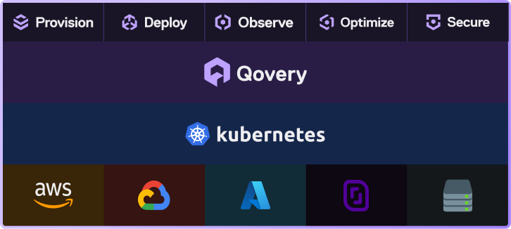

<p align="center">
  <a href="https://www.qovery.com">
    
  </a>
</p>

<h1 align="center">Qovery Engine</h1>

<p align="center">
  The orchestration runtime behind Qovery's Kubernetes control plane.
</p>

<p align="center">
  <a href="https://www.qovery.com">Website</a> ·
  <a href="https://www.qovery.com/docs">Documentation</a> ·
  <a href="https://github.com/Qovery/engine/issues">Issues</a> ·
  <a href="https://roadmap.qovery.com">Roadmap</a> ·
  <a href="https://status.qovery.com">Status</a>
</p>

<p align="center">
  
</p>

Qovery Engine turns Qovery API operations into reproducible infrastructure and Kubernetes changes. It provisions and upgrades clusters, configures the surrounding cloud infrastructure, and deploys applications and managed services.

Written in Rust, the Engine combines Terraform, Helm, `kubectl`, and container tooling with Qovery's domain logic. It is the execution layer of the Qovery platform, rather than a general-purpose deployment SDK.

## What the Engine does

- **Provision** Kubernetes and the cloud resources it needs, including networking, registries, and cluster add-ons.
- **Deploy** applications, jobs, databases, and environment dependencies as a coordinated operation.
- **Operate** infrastructure through provider-aware workflows for AWS, Google Cloud, Azure, Scaleway, and self-managed Kubernetes.
- **Reconcile safely** by rendering the desired configuration before applying the Terraform and Helm changes needed to reach it.

For the product-level view, see [How Qovery works](https://www.qovery.com/docs/getting-started/how-it-works).

## Demo

This terminal walkthrough shows the Qovery CLI driving a deployment through the Engine:

[](https://asciinema.org/a/370072)

## Run an Engine request locally

The Engine service receives a typed deployment request, creates the corresponding task, then runs it. For local investigation, the application binary can replay a captured request:

```shell
LIB_ROOT_DIR="$PWD/lib-engine/lib" \
WORKSPACE_ROOT_DIR="$PWD/.qovery-workspace" \
DEPLOY_FROM_FILE_KIND=env \
DEPLOY_FROM_FILE=/absolute/path/to/environment-request.json \
TEST_CLUSTER=true \
cargo run --bin engine
```

Use `DEPLOY_FROM_FILE_KIND=infra` for an infrastructure request. A replay can create, modify, or delete cloud resources; use a dedicated test account and a request whose credentials you understand.

## Integrate the library

The library's entry point is a task. The Engine service builds the request and its operational dependencies (Docker, logging, metrics, and the Qovery API implementation), then delegates the work to that task.

```toml
# Cargo.toml
[dependencies]
qovery-engine = { git = "https://github.com/Qovery/engine", branch = "main" }
```

```rust,ignore
use qovery_engine::{
    engine_task::Task,
    environment::{models::types::DeployedEngineVersion, task::EnvironmentTask},
    io_models::engine_request::EnvironmentEngineRequest,
};

let request: EnvironmentEngineRequest = load_environment_request()?;
let deployed_engine_version: DeployedEngineVersion = load_engine_version()?;

let task = EnvironmentTask::new(
    request,
    workspace_root_dir,
    deployed_engine_version,
    lib_root_dir,
    aws_apn_id,
    docker,
    logger,
    metrics_registry,
    qovery_api,
    None,
);

task.run();
```

The snippet is intentionally marked `ignore`: constructing a production task requires credentials, a complete `EnvironmentEngineRequest`, and concrete implementations of the operational dependencies. The [application bootstrap](../app/src/main.rs) shows the complete wiring, while the [integration tests](tests) provide provider-specific working examples.

## Develop locally

The Engine is part of the [`Qovery/engine`](https://github.com/Qovery/engine) workspace. Run development commands from the repository root.

### Prerequisites

- [Rust](https://www.rust-lang.org/tools/install) (version pinned in [`rust-toolchain`](../rust-toolchain))
- [mise](https://mise.jdx.dev/) to install the repository's development tools
- Docker, Terraform, Helm, and `kubectl` for runtime and integration workflows

Cloud credentials and provider CLIs are only needed for the integration tests or when running a real deployment.

```shell
git clone https://github.com/Qovery/engine.git
cd engine

mise install
mise run build
mise run lint
```

`mise run lint` runs formatting checks and workspace Clippy. The full feature matrix is slower but catches provider-specific regressions:

```shell
mise run lint-matrix
```

Run the focused unit and binary test suite with:

```shell
mise run unit-tests
cargo test --manifest-path app/Cargo.toml
```

The Engine service requires a valid deployment request and cloud configuration; it is not a standalone end-user CLI. To deploy an application, use the [Qovery console](https://console.qovery.com), [CLI](https://github.com/Qovery/qovery-cli), [Terraform provider](https://www.qovery.com/docs/terraform-provider/overview), or API.

## Contribute

Contributions are welcome. Start with the [contribution guide](CONTRIBUTING.md), then open a [GitHub issue](https://github.com/Qovery/engine/issues) for bugs or a [pull request](https://github.com/Qovery/engine/pulls) for a proposed change.

Changes to deployment behavior should include the smallest relevant regression coverage. Before opening a pull request, run `mise run lint` and the affected test suite.

## Get help and report security issues

For product usage and configuration, use the [Qovery documentation](https://www.qovery.com/docs) or [contact Qovery](https://www.qovery.com/contact). Use [GitHub Issues](https://github.com/Qovery/engine/issues) for reproducible Engine bugs and feature proposals.

Please report potential security vulnerabilities privately at [security@qovery.com](mailto:security@qovery.com), rather than in a public issue.

## License

Qovery Engine is licensed under [GPL-3.0](LICENSE).
